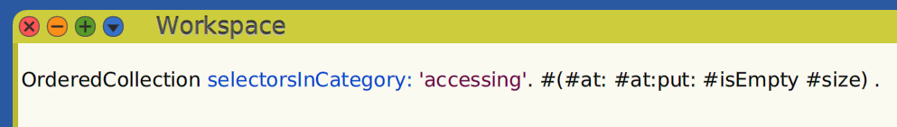

# **Smalltalk: Conceptual Integrity in Action.**


*C.R. Knight: Mural of the La Brea Tar Pits, featured on the cover of *The Mythical Man-Month* by Fred Brooks.*

One of the most eye-opening and influential ideas in my journey as a programmer was the concept of ‘conceptual integrity’, introduced by Fred Brooks in *The Mythical Man-Month* in his essay *Aristocracy, Democracy, and System Design*. 

>It is better to have a system omit certain anomalous features and improvements, but to **reflect one set of design ideas**, than to have one that contains many good but independent and uncoordinated ideas.
>
> *Fred Brooks*

In a nutshell, conceptual integrity consists of a set of well-related, composable concepts and the relationships between them, forming a kind of conceptual algebra.

When we introduce a new concept that doesn’t integrate well with the others, the conceptual algebra suffers in the form of increased complexity. Special or exceptional cases must be considered, which limits the expressiveness of the algebra and raises the cognitive load for those who have to play with it. Just one poorly selected concept affects the whole.

In a way, what Brooks is suggesting is that design lives in the constraints we impose on the material we work with. This is especially true in software development. 

Unlike other forms of human craftsmanship, software has more flexible constraints. For example, when building a bridge, we encounter hard limits imposed by factors like gravity, wind, vibrations, and material strength — all of which must be calculated and accounted for before construction even begins.

Software is, by nature, a very malleable creature, with its hard limits mostly imposed by hardware: the computing power, the volatile and persistent storage, and the capacity of the network connection<sup>[1](#footnote-1)</sup><a id="footnote-1-back"></a>.

Another point where the analogy between building software and building things in the physical world is also broken is at how those different creations handle the pass of time and the changes, and the expectations we have about that. 

For the things built in the physical world, in general, we expect that those things would be more or less durable and maintain their original characteristics until we finish to used them. No one expects that a bridge automatically gets wider because the traffic that passes over it increases substantially or shrinks when the traffic decreases. That is exactly what we expect from software, we want it to change and adapt automatically. Designing software to show resilience to changes over time is apparently an important feature to consider.

If we build software like we build bridges, we end up with a piece of software very hard to change and doomed to be maintained until someone with the authority (but probably without the knowledge) decides to destroy it and build it again. Any resemblance with reality is purely coincidental.

### **Designing by Subtraction**

Subtracting the superfluous to reveal the essence, or the soul, of a creation is a well-known process in arts.

>“Perfection is achieved, not when there is nothing more to add, but when there is nothing left to take away.”
>  
>*Saint-Exupéry*

 Another phrase, attributed to a multi-talented artist primarily known as a sculptor, captures this idea pragmatically.

>“I saw the angel in the marble and carved until I set him free.”   
>
>*Michelangelo Buonarroti*

I think that we can follow a similar process for software. While the static nature of sculpture might not be a good analogy for a running program, the idea of revealing a design that’s already present in the problem domain sounds like a good guideline to me. The attitude of unveiling a design instead of trying to impose one on the problem should distance us from the root of all evils in programming.

>Premature optimization is the root of all evil (or at least most of it) in programming.
>  
> *Donald Knuth*

To achieve that in software, we should model the problem at hand in a way that no artificial complexity is added to the solution model. Much like a sculptor carving away marble to reveal the form within, we should aim to reduce artificial complexity to a minimum during iterations in software design, refining our solution until the true essence of the problem we’re addressing is revealed.

### **The Problem of Computing Things**


*Alan Turing (left) and Alonzo Church (right)*

When searching for the roots of computation, we could find two seminal and isomorphic works: Alan Turing’s Turing Machine and Alonso Church’s Lambda Calculus. Discussing these in detail would require an entire article, but it is important to note that each has its own computation metaphor. 

Turing’s approach is more mechanical, with an abstract machine manipulating symbols on an infinite tape, while Church’s Lambda Calculus expresses computation through function abstraction and application, like an ancient ancestor to Lisp.

Smalltalk also has its own computation metaphor, where the message-passing concept plays a fundamental role. Biological information processing was the source of inspiration for Alan Kay<sup>[2](#footnote-2)</sup><a id="footnote-2-back"></a>, the way that cells interchange information through protein messages and influences the behavior of the receiving cell is the base model for Object Oriented Programming<sup>[3](#footnote-3)</sup><a id="footnote-3-back"></a>.

>“The shift in point of view here is \[…\] if you take things like clocks they don’t scale by a factor of a hundred very well. Take think like cells they not only scale by a factor of a hundred but by factors of trillion, and the question is, how do they do it, and how might we adapt this idea for building complex systems.”<sup>[4](#footnote-4)</sup><a id="footnote-4-back"></a>  
>
>*Alan Kay at OOPSLA 1997*

The core idea Kay is illustrating is that biological systems offer a model of scalability and adaptability that can be a useful analogy for thinking about how we design complex software systems.

>“The ARPANET, of course, became the Internet, and from the time it started running — just around 1969 or so — to this day, it has expanded by about a factor of a hundred million. \[…\] There is not one line of code in the Internet today that was in the original ARPANET. \[…\] This is a system that has expanded by a hundred million, has changed every atom and every bit, and has never had to stop. **That is the metaphor we absolutely must apply to what we think are smaller things.”**
>  
>*Alan Kay at OOPSLA 1997*

Kay provides the Internet as a practical illustration of how to model systems that mirror the scalability of natural systems. His design of OOP, inspired by biological processes, shares similarities with the modular, decentralized, and dynamic nature of the internet, where objects interact through message-passing much like how nodes in a network communicate.

### **Communicating Objects**

In Smalltalk, if we want that something happens we must follow the form: 

Object message

Even arithmetic, string concatenation, and control flow follow this pattern. This is where the expression *In Smalltalk, everything is an object* finds its deeper meaning. This idea isn’t just a declaration; it’s a practical reality. Everything is an object not because some gods on Olympus declared it, but because the only way to perform any computation is by sending a message to an object — period.

For instance, the sum of 2 integers is resolved by sending a message ***\+*** to the left number, with the right number passed as the message’s argument. Sentences in Smalltalk ends with a dot, similar to a semicolon (`;`) in other languages; the result of the evaluation is printed after the dot.

```Smalltalk
2 + 2. 4
```

This marks a fundamental distinction from the vast majority of mainstream programming languages, where such computations are hardcoded into the language’s syntax, even in those that refer to themselves as object-oriented.

But that decision comes with a cost: Smalltalk loses the familiar operator precedence found in mathematical expressions. 

```Smalltalk
2 + 2 * 3. 12
```

We must be explicit to ensure the common precedence of mathematical operations.

```Smalltalk
2 + (2 * 3). 8
```

Smalltalk sticks to its notion of computation and doesn’t break the object-message computation form just to have a more convenient mathematical precedence. It’s as if Smalltalk were telling us, ‘Sure, having math expressions with well-known operator precedence sounds good, but it doesn’t mesh well with my more important concept of message-passing computation. I’d rather leave that aside.’

If Smalltalk were to incorporate mathematical expressions with standard operator precedence, it would introduce a special case: math expressions would function as a sublanguage within Smalltalk — a kind of DSL embedded in the main language — increasing the complexity of the implementation, in particular the compiler, which would have to handle arithmetic operators and its precedence. In the current solution, however, the compiler remains completely agnostic to math operators.

More importantly, including mathematical expressions with standard operator precedence would break the message-passing computation form, affecting the entire conceptual algebra just to incorporate an idea that seems good at first glance. Leaving this idea aside preserves conceptual integrity, resulting in a terser syntax with no special cases.

In Smalltalk, a number is just like any other object that needs to receive a message to make a computation. This beautifully reminds me of another passage of the same essay from Brooks.

>Simplicity and straightforwardness proceed from the conceptual integrity. Every part must reflect the same philosophies and the same balancing of desiderata. Every part must even use the same techniques in syntax and analogous notions in semantics.
>
>*Fred Brooks*

Even more interesting than arithmetic is the case of control flow. In most programming languages we must use reserved words, such as if-then-else blocks or similar to control the flow of a program.

```
if condition then  
 ...  
else  
 ...  
end
```

That is not the case with Smalltalk. Staying true to its computing model, there is no special syntax for controlling program flow — just plain old message sending to objects.

```smalltalk
condition ifTrue: [ ... ] ifFalse: [ ... ]
```

Here, the message name is *ifTrue:ifFalse:* which receives two blocks: one for the true case and another for the false case. Blocks represent a piece of code—essentially, a set of object collaborations in object-oriented parlance—and they allow us to defer code execution until needed by sending the message *value* to the block. In this case, only one of the blocks will be executed, depending on the condition.

A key point that’s easy to overlook is that the selection of which block to execute depends on the class of the condition object. In Smalltalk, the method *ifTrue:ifFalse:* is defined abstractly in the ***Boolean*** class but is implemented differently in its concrete subclasses, ***True*** and ***False***.

```smalltalk   
True>>ifTrue: trueAlternativeBlock ifFalse: falseAlternativeBlock  
   ^ trueAlternativeBlock value

False>>ifTrue: trueAlternativeBlock ifFalse: falseAlternativeBlock  
   ^ falseAlternativeBlock value
```

This beautiful implementation illustrates the essence of object-oriented programming: when a message is sent to an object, it is the object itself that determines which method will be used to respond<sup>[5](#footnote-5)</sup><a id="footnote-5-back"></a>. It’s a fully polymorphic way of understanding control flow.

Completely aligned with Brooks’ ideas, we can find the following paragraph in the book *Smalltalk-80: The Language and Its Implementation*, also known as *The Blue Book*. 

>Smalltalk is based on a small number of concepts \[…\] Due to the uniformity with which the object-message orientation is carried out in the system, there are very few new programming concepts to learn in order to understand Smalltalk.
>  
> *From Blue Book*

### **Encapsulation**

>“Once you have encapsulated in such a way that there is an interface between the inside and the outside it is possible to make an object act like anything, and the reason is simply this, that what you have encapsulated is a computer.”
>  
>*Alan Kay at OOPSLA 1997*

Deeply connected to the idea of message-passing computation is the concept of encapsulation. In fact, encapsulation, in some sense, enables message-passing computation to exist: encapsulation creates a boundary between the inside and outside of an object, and it is this boundary that demands an interface to make computation possible. That interface, in turn, allows the object to decide how to respond internally when it receives a message from the outside.

Thinking of objects as tiny, specialized computers communicating with each other over a network is a powerful analogy. When one computer on the internet communicates with another, it follows a common message protocol to exchange information but doesn’t permit direct access to its volatile or persistent storage. Why? Because allowing an external computer to write directly to its storage would lead to chaos, stripping away its autonomy. This loss of control would break the system’s ability to make decisions, compromising the very foundation of message-passing computation.

A DTO<sup>[6](#footnote-6)</sup><a id="footnote-6-back"></a> is a typical example of what an object is not. Being completely open to the outside, it loses its ability to decide what to do, breaking the principle of encapsulation. This unrestricted external access contradicts the autonomy of true objects. A DTO is more like a specialized data structure, similar to a dictionary, that merely mimics an object but lacks its essential characteristics.

Encapsulation and message-passing computation reinforcing each other in an algebraic form that preserves the system’s conceptual integrity. By conceptualizing objects as autonomous entities, much like specialized computers, we can design modular systems that exhibit uniformity from their most basic components to the most complex constructs.

>\[In\] Smalltalk, which is built on the model of communicating objects, \[…\] large applications are viewed in the same way as the fundamental units from which the system is built.
>  
>*Dan Ingalls in Design Principles Behind Smalltalk*

### **Late Binding**

Every time we send a message to an object, the Smalltalk virtual machine runs an algorithm called *method lookup,* which locates the appropriate method based on the receiver object and message. A key concept here is that the message and the method are mediated by a kind of dynamic switch-case mechanism embedded in the virtual machine *for our profit*, effectively embodying the fundamental theorem of computer science that states:

>"We can solve any problem by introducing an extra level of indirection."<sup>[7](#footnote-7)</sup><a id="footnote-7-back"></a>

This mechanism links the message to the actual implementation code — the method. **The *What* and the *How* are decoupled**. This conceptual and practical distinction, between the *What* and the *How* — between the intention and the realization — is incredibly powerful. Combined with the ubiquity of message-passing computing style, it offers flexibility in virtually every computation we perform.

In Smalltalk sending a message is a way to express choices.

```smalltalk
myObject open
```

When a message like *open* is sent to *myObject,* Smalltalk’s method lookup process dynamically determines which implementation of *open* to execute, depending on the class of *myObject*. Whether *myObject* is a file, a window, or a tool, each will interpret and respond to the *open* message according to its specific behavior.

>Smalltalk provides a \[…\] cleaner solution: it sends the *name* of the desired operation, along with any arguments, as a *message* to the \[object\], with the understanding that the receiver knows best how to carry out the desired operation.  
>
>*Dan Ingalls in Design Principles Behind Smalltalk*

At OOPSLA 1997, Alan Kay uses the Japanese concept of *ma* to underscore a process-oriented perspective on objects — one that focuses on the space for dynamic interactions and responses within the message-passing model.

>“Ma is the stuff in-between what we call objects. It’s the stuff we don’t see, because \[in the western culture\] we’re focused on the nounness of things rather than the processness of things.” 
> 
>*Alan Kay at OOPSLA 1997*

*Ma* refers to an intentional *gap* or *interval* that allows space for the interpretation of meaning. Sending a message involves more than just a direct action — there’s a conceptual space where the object decides how to respond.

The separation of *What* from *How* enables objects to autonomously determine their responses. Smalltalk dynamically aligns intention with execution, holding off the decision of which implementation to execute until the last moment.

>“One of the great principles of computer science it’s laziness or whatever you call it, late binding. Hold off decisions when you can.”
>  
> *Donald Knuth*

### **Meta-System**

>“The more the language can see its own structures the more liberated you can be from the tyranny of a single implementation.”
>  
>*Alan Kay at OOPSLA 1997*

One of the effects of applying the metaphor of communicating objects consistently across Smalltalk is that the language constructs themselves become part of the universe of objects available to us as Smalltalk programmers. And it is exactly this effect that was taken advantage of to create all the visual tools that are part of a typical Smalltalk distribution. 


*Listing the OrderedCollection class selectors in the accessing category.*

Debuggers, inspectors, explorers, and browsers in Smalltalk are built with the language itself, utilizing its extensive reflexivity and metaprogramming capabilities. 


*Browsing the OrderedCollection class, listing its accessing methods.*

Additionally, the visual components of Smalltalk user interface are Smalltalk objects, which means we can inspect, explore, and debug those components just like any other object<sup>[8](#footnote-8)</sup><a id="footnote-8-back"></a>.


*Exploring a text editor*

>Every component accessible to the user should be able to present itself in a meaningful way for observation and manipulation.
>
>*Dan Ingalls in Design Principles Behind Smalltalk*

What is even more surprising is that this remarkable level of reflectivity and metaprogramming occurs in an open and live object environment. *Open* means that all the objects constituting the base system are accessible for our inspection and modification; **our code operates on the same level as the base system**. *Live* means that we can program, inspect, and modify while the objects are running, freeing us from the conventional edit-compile-run-stop loop.

Smalltalk people call that the meta-system<sup>[9](#footnote-9)</sup><a id="footnote-9-back"></a>. The meta-system empowers users to understand and modify the system itself, turning users into creators. Kay envisioned meta-systems as tools to encourage users to not just work with data but to reshape their tools and frameworks as they go. In this view, the user isn’t just operating within a closed system but actively extends, refines, and redefines the system’s boundaries.

>“I think one of the things we liked the most about Smalltalk was not what it could do, but the fact that it was such a good vehicle for bootstrapping the next set of ideas we had about how to do systems building.”
> 
>*Alan Kay at OOPSLA 1997*

### **Final Words**

Smalltalk is to me one great example of what we can achieve in system building if we actively follow the concept of conceptual integrity. 

As we’ve seen, Smalltalk is more than just a programming language — it’s an entire interactive programming environment, grounded in a small, interwoven set of concepts applied recursively across both language and system levels. Even more, Smalltalk offers a unique approach to thinking about computation itself. Its metaphor, *everything is an object,* is applied uniformly across all areas, reinforcing a powerful and cohesive model of computation.

Smalltalk, as designed by Alan Kay and his team<sup>[10](#footnote-10)</sup><a id="footnote-10-back"></a>, aimed to deliver this level of integrity by building a cohesive environment where all components, from the language syntax to the user interface, consistently reflect the object-oriented paradigm.

By conception, Smalltalk is a tool meant to release the creativity of those who use it, a standpoint for bringing the next big set of ideas about system building. In the words of Alan Kay himself:

>\[Smalltalk is\] an attempt to give the world a bootstrapping mechanism for something much better than Smalltalk.
>  
>*Alan Kay at OOPSLA 1997*

*Licensed under [CC BY-SA 4.0](https://creativecommons.org/licenses/by-sa/4.0/).*

---

*Footnotes:*

\[1\]: <a id="footnote-1"></a> Nowadays with the access to cloud computing those limits are even more relaxed. [(back)](#footnote-1-back)

\[2\]: <a id="footnote-2"></a> It’s not a coincidence that those ideas come from Alan Kay; he majored in biology focused on both cell metabolism and larger scale morphogenesis and minored in mathematics centered on abstract algebras. [(back)](#footnote-2-back)

\[3\]: <a id="footnote-3"></a> Alan Kay has expressed regret for coining the term *Object-Oriented Programming* (OOP). He has criticized himself, saying he should have used a more process-oriented term, as the most important concept is what happens between objects. [(back)](#footnote-3-back)

\[4\]: <a id="footnote-4"></a> A quote from Alan Kay: *“In many talks, long ago, I have shown a picture with the title “From Gears To Biology” as a metaphor for a qualitative shift in thinking about computer systems — from early-bound, tightly coupled rather small mechanisms — like clocks — to late-bound, loosely coupled rather large mechanisms — like living organisms. In computing, this happened within a single lifetime, and many parts of computing are still stuck in the earlier metaphor.”* [(back)](#footnote-4-back)

\[5\]: <a id="footnote-5"></a> In Smalltalk, comparison messages like *\>*, *\<* and *\=* return instances of the *True* or *False* classes. [(back)](#footnote-5-back)

\[6\]: <a id="footnote-6"></a> Data Transfer Object (DTO): Commonly used in many languages, DTOs are objects meant to transport data between systems or layers in an application. They typically have getter and setter methods but lack significant logic, they expose all their fields through public methods. [(back)](#footnote-6-back)

\[7\]: <a id="footnote-7"></a> Except for the problem of too many levels of indirections. [(back)](#footnote-7-back)

\[8\]: <a id="footnote-8"></a> *Morph* is the top-level class for any visual component in Smalltalk (Squeak family). Paraphrasing Smalltalk’s own metaphor: *every visual component is a Morph.* [(back)](#footnote-8-back)

\[9\]: <a id="footnote-9"></a> A meta-system is a computational system that has as its domain another computational system called its object domain. [(back)](#footnote-9-back)

\[10\]: <a id="footnote-10"></a> Mainly Dan Ingalls and Adele Goldberg among others. Dan Ingalls was instrumental in implementing the early versions of Smalltalk, while Adele Goldberg was influential in documenting and promoting its use. [(back)](#footnote-10-back)

*References:* 

[The Mythical Man-Month](https://en.wikipedia.org/wiki/The_Mythical_Man-Month) 

[Alan Kay at OOPSLA 1997 — The computer revolution hasn’t happened yet (youtube.com)](https://www.youtube.com/watch?v=oKg1hTOQXoY&list=PL47Z8KjiFwi4gtoHPQ93MzDkw6rSE-3hC&index=2)

[Donald Knuth: Premature optimization is the root of all evil | Donald Knuth and Lex Fridman ()youyoutube.com)](https://www.youtube.com/watch?v=74RdET79q40) 

 [‘Computing is not about clocks, it’s about biology’. How come the essence of computing is more about the way living organisms evolve? — Quora](https://www.quora.com/What-does-Alan-Kay-suggest-here-Computing-is-not-about-clocks-its-about-biology-How-come-the-essence-of-computing-is-more-about-the-way-living-organisms-evolve)

[Hernan Wilkinson at FAST 2014 — How Smalltalk Affects Thinking (youtube.com)](https://www.youtube.com/watch?v=brdx8YAVZag)

[Aprendiendo Smalltalk con Hernan Wilkinson](https://www.youtube.com/watch?v=blj7itWxk2Y&list=PLMkq_h36PcLCtLKrrdOKKFV2r267VFH_t&index=1)

[Glenn Vanderburg — Real Software Engineering (youtube.com)](https://www.youtube.com/watch?v=RhdlBHHimeM)

[Stef’s Free Online Smalltalk Books (Blue Book)](http://stephane.ducasse.free.fr/FreeBooks.html)

[Design Principles Behind Smalltalk](https://www.cs.virginia.edu/~evans/cs655/readings/smalltalk.html)

[Advanced object-oriented design and development with Pharo — Course — FUN MOOC (fun-mooc.fr)](https://www.fun-mooc.fr/en/courses/advanced-object-oriented-design-and-development-with-pharo/)

[Meta-environment and executable meta-language using Smalltalk: an experience report](https://scg.unibe.ch/archive/drafts/Duca08a-Sosym-ExecutableMetaLanguage.pdf)

