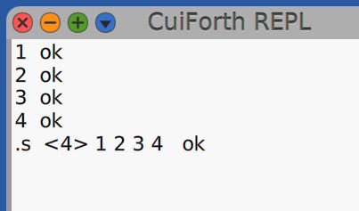

# Smalltalk meets Forth: Episode I


The idea is simple: build a Forth interpreter in Smalltalk in a series of posts and learn some Forth and Smalltalk in the process.

For this first session we would like to end with a fully working Forth REPL with at least some of the basic math words implemented. Also, a pretty basic error handling would be good to have from the beginning.

There are several Smalltalk flavors to choose from, but I share Cuis-Smalltalk’s love for small, simple, and understandable things. So, ‘Cuis, I choose you!’ 🐹

Another tool for the journey is the Forth standard. I aim to use its references, jargon, and overall organization to keep the interpreter as close to the standard as possible, while still allowing room for more creative or implementation-specific words.

One advantage we have is there are many Forth implementations out there, so we can use them as a reference of the word's behaviors and outputs on the REPL, [GForth](https://gforth.org/) and [SwithForth](https://www.forth.com/swiftforth/) would be a good source of inspiration.

I prefer to introduce the Forth concepts as we need it, but a little introduction will put us all on the same page.

## Forth

Forth is a stack-based, concatenative programming language and environment that is designed for simplicity and extensibility. Stack-based means that Forth uses a stack to hold data and control flow, operations are performed by pushing and popping values from the stack. We can think in Forth as a thin abstraction over a stack machine.


Concatenative means that programs are composed of sequences of words that can be combined together. Each word can be defined in terms of other words, allowing for a high degree of modularity and reuse.


> Forth typically combines a compiler with an integrated command shell, where the user interacts via subroutines called words. Words can be defined, tested, redefined, and debugged without recompiling or restarting the whole program. All syntactic elements, including variables, operators, and control flow, are defined as words. A stack is used to pass parameters between words, leading to a Reverse Polish Notation style.
> 
> From Wikipedia

Similar to Smalltalk, which has the strong metaphor ‘Everything is an object’, Forth embodies the idea that ‘Everything is a word’.

## The REPL

One thing I really enjoy about Smalltalk is its level of interactivity; you have inspectors, explorers, and debuggers that allow you to have a programming conversation with the environment. I want to keep the journey as conversational as possible, so we need to start by creating a simple REPL where we can experiment with our Forth implementation as we build it.


The good news is that the Cuis environment already has a similar editor we can use as a reference to understand how it’s built. The Text Editor offers more functionality than a REPL, so we can think of a REPL as a limited version of a Text Editor, with some features intentionally restricted. It might be a bit much, but the structure and most of the behavior are useful for our case. I think it could be a good place to start.


Exploring the Text Editor using the halos, we learn that the main Morphic structure of the Text Editor is:

*SystemWindow-> LayoutMorph -> TextModelMorph -> InnerTextMorph*

The halos in Smalltalk offer an interactive way to explore graphical objects. By clicking on halos, you can inspect graphical object properties and relationships, providing a hands-on approach to understanding the system.


After spending some time tinkering and winging it with browsers, explorers and inspectors, I found that the behavior we need to specialize is mostly within the InnerTextMorph. Also, we need to make a little adjustment to TextModelMorph to use the specialized InnerTextMorph.

I create ForthTextModelMorph and ForthInnerTextMorph classes which are subclasses of TextModelMorph and InnerTextMorph respectively.

```smalltalk
TextModelMorph subclass: #ForthTextModelMorph
   instanceVariableNames: ''
   classVariableNames: ''
   poolDictionaries: ''
   category: 'CuiForth-Morph'

InnerTextMorph subclass: #ForthInnerTextMorph
   instanceVariableNames: ''
   classVariableNames: ''
   poolDictionaries: ''
   category: 'CuiForth-Morph'
```

It is necessary to set the inner morph class for ForthTextModelMorph.

```smalltalk
ForthModelMorph>>innerMorphClass
    ^ ForthInnerTextMorph
```

This step determines that the inner text handling behavior of ForthModelMorph will be managed by ForthInnerTextMorph.

To integrate the entire morph structure, we introduce the ForthREPL class. This is the primary class responsible for running the REPL, initializing the system, and holding the Morphic structure.

```smalltalk
Object subclass: #ForthREPL
    instanceVariableNames: 'window'
    classVariableNames: ''
    poolDictionaries: ''
    category: 'CuiForth-Window'

ForthREPL>>initialize
    | forthTextModelMorph forthTextModel |
    super initialize.
    forthTextModel := ForthTextModel new.
    forthTextModelMorph := ForthTextModelMorph new.

 "Connnect the text models"
 forthTextModelMorph model: forthTextModel.

 "The Forth model morph will use all the available width and heigth"
 forthTextModelMorph layoutSpec
     proportionalWidth: 1.0;
     proportionalHeight: 1.0.

 "Main window configuration"
 window := SystemWindow new
     setLabel: 'CuiForth REPL';
     model: forthTextModel;
     addMorph: forthTextModelMorph.
```

The structure ends like this:

*SystemWindow -> LayoutMorph -> ForthModelMorph -> ForthInnerTextMorph.*

Another little method to open the REPL could be handy.

```smalltalk
ForthREPL>>open
    window openInWorld.
```

The ForthInnerTextMorph is where we need to add our keystroke handle logic. The most important thing is to handle the return key to process the words at the current line. The rest of the logic is to customize the text editor to behave like a REPL.

```smalltalk
ForthInnerTextMorph>>keyStroke: aKeyboardEvent
    aKeyboardEvent isReturnKey ifTrue: [
        editor processWords
    ].

    "We don't want backspace to go back to the previous line"
    self ignoreBackspaceWhenLineIsEmpty: aKeyboardEvent.

    "For now, ignore the up and down arrow keys;
       they could serve later to navigate previous commands"
    self ignoreUpArrowKey: aKeyboardEvent.
    self ignoreDownArrowKey: aKeyboardEvent.

    "Let the normal keystroke processing continue"
    super keyStroke: aKeyboardEvent.
```

Notice that for word processing ForthInnerTextMorph delegates this responsibility in its internal collaborator editor (ForthEditor). This separation of concerns might allow us to reutilize the editor with other Morphic configuration.

```smalltalk
TextEditor subclass: #ForthTextEditor
    instanceVariableNames: 'extractedWords interpreter'
    classVariableNames: ''
    poolDictionaries: ''
    category: 'CuiForth-Text'
```

Notice that the editor knows the interpreter. The class of the text editor is configured in the text model class:

```smalltalk
TextModel subclass: #ForthTextModel
    instanceVariableNames: ''
    classVariableNames: ''
    poolDictionaries: ''
    category: 'CuiForth-Text'

ForthTextModel>>editorClass
    ^ ForthTextEditor
```

The main responsibility of the ForthEditor is handled by its processWords message. This method is designed to extract the words from the current line (after the return key is pressed), pass those words to the interpreter, and display the interpreter’s output to the user. For now, a placeholder implementation that always responds with ‘ok’ for any input will suffice.

```smalltalk
ForthEditor>>processWords
    self addString: ' ok'
```

Let’s open the REPL and do some manual testing.


Until now, I've used a more exploratory programming style, checking changes in the Workspace. For the remaining features, I followed a mostly TDD approach, but I don’t think that’s the best flow for the article — let me continue with a more descriptive tone.

With the REPL ready we can start to implement Forth features.

### A Note about the REPL

A REPL is the usual way to interact with Forth, giving quick feedback as you type. But in Smalltalk, the go-to tool for playing with code is the Workspace. It’s like a live text editor where you can write, run, and tweak code snippets on the spot. We’ll explore that possibility for our Forth interpreter later.


## The Stack

As we said, Forth is stack-based. In general, it has two main stacks: the data stack and the return stack. The former holds data items, and the latter manages return addresses for control flow. Let’s start with the former.

We only need a classic stack, with a pretty printString method to use later.

```smalltalk
Object subclass: #ForthDataStack
    instanceVariableNames: 'collection'
    classVariableNames: ''
    poolDictionaries: ''
    category: 'CuiForth-Interpreter'

ForthDataStack>>initialize
    collection := OrderedCollection new.

ForthDataStack>>pop
    collection ifEmpty: [ StackUnderflow signal ].
    ^ collection removeLast

ForthDataStack>>push: anElement
    collection addLast: anElement

ForthDataStack>>printString
    | count items |
    count := collection size asString.
    items := collection inject: '' into:
        [ :acc :item | acc, item printString, ' '].

   ^ ('<', count, '> ', items)
```

The most interesting thing here is that the stack signals a StackUnderflow if we try to pop an element when the collection is empty. In Forth, all parameters are passed via the stack, with words operating by popping and pushing data to and from it. If a word needs a parameter that isn’t on the stack, we definitely want to know.

## The Interpreter

Finally, we arrive at the core of the project: the Forth interpreter. First, we’ll discuss the general logic, followed by some interesting implementation details.

```smalltalk
Object subclass: #ForthInterpreter
    instanceVariableNames: 'dataStack display'
    classVariableNames: ''
    poolDictionaries: ''
    category: 'CuiForth-Interpreter'
```

The dataStack internal collaborator is self-explanatory: it holds an instance of the ForthDataStack, as discussed earlier. The display is where printable messages generated during the interpretation process are stored. The editor object will use this to show messages to the REPL user.

The interpreter is responsible for implementing all Forth words. To organize them, I’ve used the standard group names as message categories. The naming conventions follow the standard as the main reference.


Forth standard categories into messages categories: 


The main message of the interpreter is execute:

```smalltalk
ForthIntepreter>>execute: textWords
    | tokens |

    self clearDisplay.

    tokens := self tokenize: textWords.

    tokens do: [ :token |
       [ token execute: self ]
           on: ForthError
           do: [ :error | ^ self display: error description ]].

    self displayOk
```

The method receives a line of text (the words), tokenizes it, and then processes each token one by one. Tokenization in Forth refers to splitting the line of text into individual words (or tokens), which are separated by whitespaces. Each token is treated as an atomic command or operand, and the interpreter executes these in sequence. This straightforward process is key to how Forth operates, where each word in the code is treated as a command, making the interpreter’s design simpler and more direct.

Forth’s tokenization typically does not involve complex parsing rules; rather, it focuses on identifying individual, space-separated sequences of characters that represent commands, variables, or numbers: words in Forth parlance. In Forth everything is a word.

```smalltalk
ForthInterpreter>>tokenize: aString
    | textWords |
    textWords := aString substrings.

    ^ textWords collect: [ :textWord |
        ForthToken newFrom: textWord ]
```

This method takes a string, splits it into words using substrings, and turns each word into a ForthToken. The ForthToken class is the base class for all tokens, and it knows how to create the right type of token from each word.


To do this, it goes through its subclasses until it finds one that matches the string. Each subclass knows how to check if it matches a given string.

```smalltalk
ForthToken class>>newFrom: aStringWord
    self tokenTypes do: [ :tokenType |
        tokenType ifMatch: aStringWord eval: [ :token | ^ token ] ].

ForthToken class>>tokenTypes
    "Return all token types in tokenization order"
    ^ self subclasses sort:
        [ :a :b | a tokenizeOrder < b tokenizeOrder ]
```

After tokenization, the interpreter executes each token one by one. One important thing to note in ForthInterpreter>>execute: is the double dispatch happening in this line:

```smalltalk
ForthIntepreter>>execute: textWords
    ...
    tokens do: [ :token |
        [ token execute: self ] "<- Double dispatch"
    ...
```

In this design, each token knows how to execute itself, sending the appropriate message to the interpreter, which holds the implementation for each word. The tokens inherit the following method:

```smalltalk
ForthToken>>execute: aForthInterpreter
    aForthInterpreter perform: self value.
```

The perform: message in Smalltalk is a powerful metaprogramming feature that allows you to send a message to an object dynamically at runtime. It takes a symbol as its parameter and sends the corresponding message to the receiver. This is especially useful in cases like our Forth interpreter, where the message to be send is determined at runtime.

In the context of our interpreter, the value of a token is its representation as a Smalltalk symbol. For example, a token value #plus represent the addition operation in Forth. The exact message that will be sent is based on the token’s symbolic value, determined during tokenization.

```smalltalk
MathSymbolToken>>newFrom: aString
    ^ self new 
        value: (self mathSymbols at: aString) asSymbol
```

Some tokens include a dictionary that maps strings to their corresponding symbols. These symbols are then converted into messages sent to the interpreter using the perform: message, as shown earlier. For example, in the MathSymbolsToken class:

```smalltalk
MathSymbolToken>>mathSymbols
   ^ `Dictionary newFrom: {
       '+' -> #plus.
       '-' -> #minus.
       '*' -> #star.
       '/' -> #slash.
   }`
```

We don’t want to reevaluate the dictionary every time. By surrounding the expression with backticks, we create a compound literal. This approach ensures all components of the compound literal are resolved when the code is compiled, rather than at runtime, acting like a constant. All components of a compound literal must be known when the code is compiled.

Looking back to the tokenization part of the process, there is an interesting thing happening in ForthToken class>>newFrom: method, there is no return except for the one in the block passed as argument to ifMatch:eval message.

```smalltalk
ForthToken class>>newFrom: aStringWord
    self tokenTypes do: [ :tokenType |
        tokenType ifMatch: aStringWord eval: [ :token | ^ token ] "<--" ].
```

Blocks in Smalltalk are full closures. This means they capture not only the values of variables from their defining context but also the entire execution environment, including the return point of the method where they are defined. Additionally, blocks support lazy evaluation, meaning the execution is deferred until explicitly evaluated. What makes them full closures is their ability to maintain this environment even when the block is executed in a different scope, which allows for non-local returns and the preservation of local state across different contexts.

```smalltalk
MathSymbolToken class>>ifMatch: aString eval: aTokenBlock
    self mathSymbols at: aString ifPresent:
        [ :symbol | aTokenBlock value: (self newFrom: symbol) ].
```

In the case of ForthToken>>newFrom:, the ^ token inside the block allows the ifMath:eval method to terminate immediately and return the desired token as soon as a match is found. When the aTokenBlock block is evaluated with the matched token passed as an argument via the value: message in the ifMatched:eval: context, the ForthToken class>>newFrom: completes and returns.

```smalltalk
ForthToken class>>newFrom: ->
    ...
    tokenType ifMatched:eval: [ :token | ^ token ] ->
        ...
        aTokenBlock eval: token "returns from newFrom:"
```

Blocks are central to Smalltalk’s language design. They enable message-based control flow (without the need for if statements), iterators (such as select:, collect: and others), lazy evaluation, non-local returns, error handling, and programming techniques like continuation passing style.

Now we have covered the main functionality of the interpreter, and some interesting details. Let’s check the word’s implementation.

## The Math

To make basic arithmetic work in our interpreter, the first thing to handle is numbers — positive and negative integers, to be specific. Earlier, we saw how tokens are recognized and how they handle their own execution. The default behavior for all tokens looks like this:

```smalltalk
ForthToken>>execute: aForthInterpreter
    aForthInterpreter perform: self value.
```

That’s okay for most words in Forth, but numbers require specialized behavior:

```smalltalk
NumberToken>>execute: aForthInterpreter
    aForthInterpreter pushToDataStack: self value.
```

Number words act as arguments for other words. Since Forth is stack-based, all arguments are pushed to and popped from the stack. So, when a number token reaches the interpreter, it needs to be pushed onto the data stack.

To add numbers, we push two numbers onto the data stack and execute the + word. We already know that the math + word is mapped to the #plus symbol in a MathSymbolToken object.

```smalltalk
MathSymbolToken>>mathSymbols
    ^ `Dictionary newFrom: {
        '+' -> #plus.
        '-' -> #minus.
        '*' -> #star.
        '/' -> #slash.
   }`
```

For this case the ForthToken>>execute inherited behavior is exactly what we need. However, the interpreter must know how to respond to the dynamically sent plus message.

```smalltalk
ForthInterpreter>>plus
    | first second |
    first := dataStack pop.
    second := dataStack pop.
    dataStack push: second + first.
```

As we can see, the method is pretty straightforward: it pops the two necessary arguments, performs the calculation, and pushes the result back onto the stack. All other arithmetic messages are resolved in the same way, with the only slightly special case being the slash message.

```smalltalk
ForthInterperter>>slash
    | first second |
    first := dataStack pop.
    second := dataStack pop.

    (first = 0) ifTrue: [ DivisionByZero signal ].

    dataStack push: second / first
```

The method checks division for zero after pop the two arguments. Why is that? because this behavior is observed in the reference implementations.

One neat effect of Smalltalk’s features is that our Forth math implementation supports fractions out of the box.


With basic arithmetic working, let’s add some programming tools.

## The Tools

In Forth jargon the dot words are the ones that Forth programmers use primarily for debugging and displaying data. The term dot words is derived from the fact that many of these words begins with a dot character. The general purpose of dot words is to facilitate interaction with the stack.

The first is the dot word:

```smalltalk
ForthInterpreter>>dot
    self displayAppend: dataStack pop printString
```

This word pops the top element from the stack and prints it.


Printing the top element of the data stack with the dot word.

The dot word is considered part of the core words in the standard. It is commonly used at the end of a one-liner to check results.


Another useful tool is the dot S word, which copies and displays the values currently on the data stack.

```smalltalk
ForthInterpreter>>dotS 
    self displayAppend:​ dataStack printString
```

Here, we simply rely on the printString message of the data stack, as discussed in the stack section earlier.



In the tokenization process, the DotWordToken is responsible for mapping the string word to its symbol representation

```smalltalk
DotWordToken class>>dotWords
    ^ `Dictionary newFrom: {
        '.s' -> #dotS.
        '.' -> #dot.
    }`
```

With these two dot words, we have a basic way to inspect the data stack.

## Error Handling

We don’t need any sophistication in error handling for now. We just need to create a basic error hierarchy to represent interpretation errors, catch that during the execution of words, and provide an error description to the user when necessary.

```smalltalk
ForthIntepreter>>execute: textWords
    ...
    tokens do: [ :token |
        [ token execute: self ]
            on: ForthError
            do: [ :error | self display: error description ]].
```


The only atypical thing is we specialize the doesNotUndestand: message of the interpreter. The doesNotUndestand: message is sent by the virtual machine to the receiver object when the method lookup fails to find a method for the sent message. It is the virtual machine giving the receiver object the chance to decide how to respond to an unexpected message.

The doesNotUndestand: message is one of those great ideas built into Smalltalk. It is considered a door to metaprogramming because we can reflect over the aMessage object and respond in very dynamic ways. However, for this case, we wanted something much simpler.

```smalltalk
ForthInterpreter>>doesNotUnderstand: aMessage
    UndefinedWord signal
```

Since the interpreter object is the receiver of the Forth words, we want the REPL to display the message ‘Undefined word’ for non-implemented words, rather than triggering the typical Smalltalk behavior of popping up a debugger.

<br>
For all other errors not subclassed from ForthError, we wanted Smalltalk’s normal behavior.

## The Editor

To complete the circle of this first iteration of the Forth interpreter, we need to finalize the editor implementation. Recall that when the user presses the return key in the REPL, the processWords message is send to the editor:

```smalltalk
ForthEditor>>processWords
    self extractWords;
        executeWords;
        printMessageToUser
```

processWords is implemented as a cascade of three private methods, each contributing to the handling of user input.

```smalltalk
ForthEditor>>extractWords
    | textWords |

    textWords := model actualContents
        copyFrom: self currentLine first
        to: self currentLine last.
    
    extractedWords := textWords asString
```

The extractWords message retrieves the string of words from the text model and stores it in the extractedWords instance variable, which serves as a pivot for the word-processing logic.

```smalltalk
ForthEditor>>executeWords
    interpreter execute: extractedWords
```

This simply sends the execute message to the interpreter, passing the freshly extracted words string.

```smalltalk
ForthEditor>>printMessageToUser
    self addString: interpreter displayMessage
```

The final step is to display feedback to the user in the REPL by printing the appropriate message from the interpreter.

With the editor logic gluing the REPL and the interpreter: The circle is now complete.

## Moving Forward

We’ve covered a lot of ground in this article — from crafting a REPL in Smalltalk’s UI to building a Forth interpreter with basic arithmetic, programming tools, and error handling. The effort pays off: it gives us a solid structure to expand the interpreter and experiment with new features in future episodes.

In the next part, we’ll keep adding features to the interpreter — probably diving into word definitions and conditionals. If you’re curious, make sure to follow along!

I left you a nerdy-motivational fact about Forth:

> The Forth programming language was used in the production of Star Wars: Episode IV — A New Hope. Specifically, it was used to control the Dystraflex motion control system, which was created by John Dykstra and his team at Industrial Light & Magic. This system was instrumental in creating the complex and precise camera movements required for the space battle scenes and the trench run sequences on the Death Star.
> 
> From Wikipedia

---

Repository: [https://github.com/jolisper/Cuis-Smalltalk-CuiForth](https://github.com/jolisper/Cuis-Smalltalk-CuiForth)